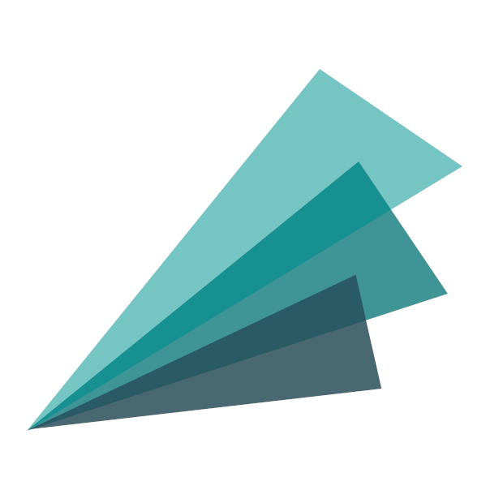

# MAKAHO [](https://makaho.sk8.inrae.fr/)

<!-- badges: start -->
[](https://lifecycle.r-lib.org/articles/stages.html)

[](https://makaho.sk8.inrae.fr/)
[](code_of_conduct.md) 
<!-- badges: end -->

[MAKAHO](https://makaho.sk8.inrae.fr/) stands for MAnn-Kendall Analysis of Hydrological Observations.

It is a [R Shiny](https://shiny.rstudio.com/) website based on [ASHE](https://github.com/super-lou/ASHE) and [EXstat](https://github.com/super-lou/EXstat) packages with [CARD](https://github.com/super-lou/CARD) code bundle. It provides an interactive cartographic solution to analyze the hydrological stationarity of French surface flows based on the data of the hydrometric stations where the flows are little influenced by the human actions.

[](https://makaho.sk8.inrae.fr/)

Data came from [Hydroportail](https://www.hydro.eaufrance.fr/) and the selection of stations follows the Reference Network for Low Water Monitoring (Réseau de référence pour la surveillance des étiages, [RRSE](https://geo.data.gouv.fr/en/datasets/29819c27c73f29ee1a962450da7c2d49f6e11c15) in french).

This project was carried out for National Research Institute for Agriculture, Food and the Environment (Institut National de Recherche pour l’Agriculture, l’Alimentation et l’Environnement, [INRAE](https://agriculture.gouv.fr/inrae-linstitut-national-de-recherche-pour-lagriculture-lalimentation-et-lenvironnement) in french).


## Installation
For latest development version 
``` 
git clone https://github.com/super-lou/MAKAHO.git
```


## Help
You can find an interactive help on the website if you press the bottom right interrogation button.


## FAQ
*I have a question.*

-   **Solution**: Search existing issue list and if no one has a similar question create a new issue.

*I found a bug.*

-   **Good Solution**: Search existing issue list and if no one has reported it create a new issue.
-   **Better Solution**: Along with issue submission provide a minimal reproducible example of the bug.
-   **Best Solution**: Fix the issue and submit a pull request. This is the fastest way to get a bug fixed.


## Code of Conduct
Please note that this project is released with a [Contributor Code of Conduct](CODE_OF_CONDUCT.md). By participating in this project you agree to abide by its terms.
